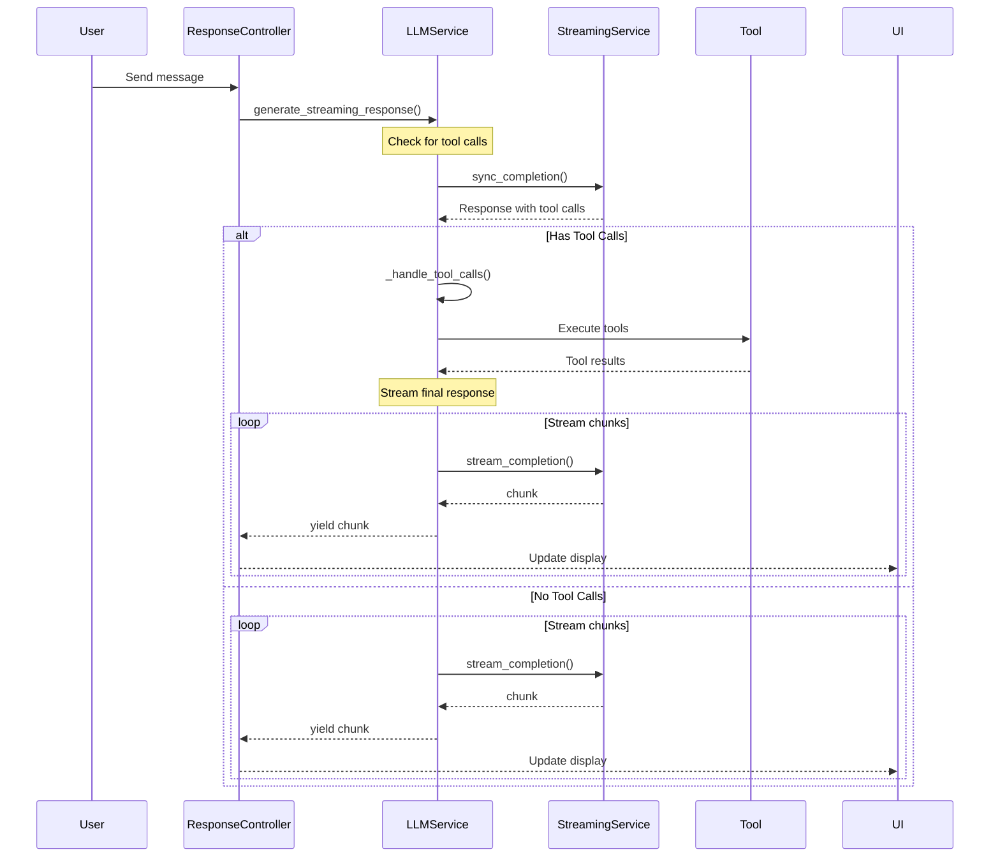

# Streaming

```mermaid
sequenceDiagram
    participant User
    participant ResponseController
    participant LLMService
    participant StreamingService
    participant Tool
    participant UI

    User->>ResponseController: Send message
    ResponseController->>LLMService: generate_streaming_response()

    Note over LLMService: Check for tool calls
    LLMService->>StreamingService: sync_completion()
    StreamingService-->>LLMService: Response with tool calls

    alt Has Tool Calls
        LLMService->>LLMService: _handle_tool_calls()
        LLMService->>Tool: Execute tools
        Tool-->>LLMService: Tool results

        Note over LLMService: Stream final response
        loop Stream chunks
            LLMService->>StreamingService: stream_completion()
            StreamingService-->>LLMService: chunk
            LLMService-->>ResponseController: yield chunk
            ResponseController-->>UI: Update display
        end
    else No Tool Calls
        loop Stream chunks
            LLMService->>StreamingService: stream_completion()
            StreamingService-->>LLMService: chunk
            LLMService-->>ResponseController: yield chunk
            ResponseController-->>UI: Update display
        end
    end
```
