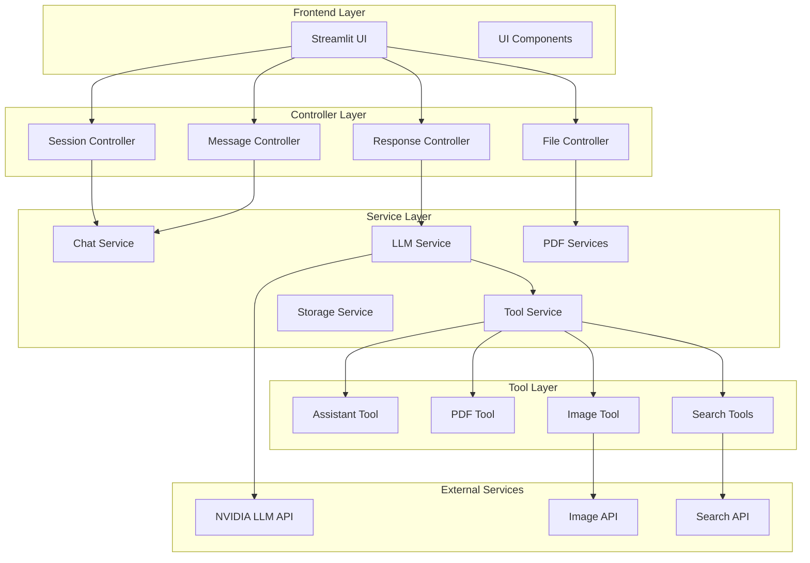
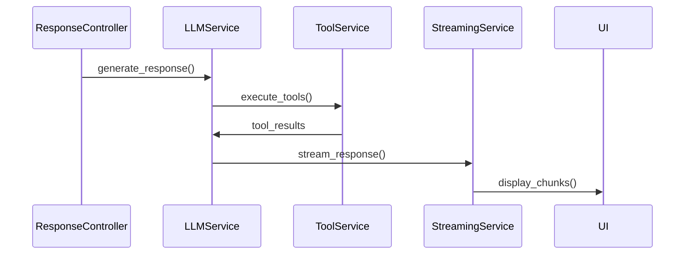

# Architecture Overview

The Streamlit Chat Application follows a production-ready Model-View-Controller (MVC) architecture with clear separation of concerns and enterprise-grade design patterns.

## High-Level Architecture



## Core Design Principles

### 1. Separation of Concerns

Each layer has distinct responsibilities:

- **UI Layer**: User interface and presentation
- **Controller Layer**: Business logic and flow control
- **Service Layer**: Core functionality and external integrations
- **Tool Layer**: Specialized capabilities

### 2. Dependency Injection

Components receive dependencies through constructors:

```python
class ResponseController:
    def __init__(self, config, llm_service, message_controller):
        self.config = config
        self.llm_service = llm_service
        self.message_controller = message_controller
```

### 3. Configuration-Driven

Centralized configuration management:

```python
# All configuration from environment
config = ChatConfig.from_environment()

# Used throughout the application
self.max_file_size = config.file_size_limit_mb
```

### 4. Stateless Services

Services are stateless for scalability:

```python
class ChatService:
    # No internal state - all state in session
    def process_message(self, message, session_state):
        # Process and return, no side effects
```

## Component Responsibilities

### Controllers

Controllers orchestrate the application flow:

- **SessionController**: Manages user session state
- **MessageController**: Handles message validation and processing
- **FileController**: Manages file uploads and processing
- **ResponseController**: Orchestrates LLM responses

### Services

Services provide core functionality:

- **LLMService**: Interfaces with language models
- **ChatService**: Processes chat interactions
- **PDFContextService**: Injects document context
- **PDFAnalysisService**: Analyzes PDF documents
- **StreamingService**: Handles response streaming
- **ToolExecutionService**: Manages tool calls

### Tools

Tools extend LLM capabilities:

- **AssistantTool**: Text processing and analysis
- **PDFTool**: Document-specific operations
- **ImageTool**: Image generation
- **SearchTools**: Web and knowledge search

## Data Flow

### 1. User Input Flow


### 2. LLM Response Flow



## Key Design Patterns

### 1. Factory Pattern

Used for creating service instances:

```python
def create_llm_client(model_type: str):
    if model_type == "fast":
        return FastLLMClient(config)
    elif model_type == "intelligent":
        return IntelligentLLMClient(config)
```

### 2. Strategy Pattern

For PDF processing strategies:

```python
class PDFAnalysisService:
    def select_strategy(self, page_count):
        if page_count <= 5:
            return SmallDocumentStrategy()
        elif page_count <= 15:
            return MediumDocumentStrategy()
        else:
            return LargeDocumentStrategy()
```

### 3. Observer Pattern

For progress tracking:

```python
class ProgressObserver:
    def update(self, progress, message):
        st.session_state.pdf_analysis_progress = {
            'progress': progress,
            'message': message
        }
```

## Scalability Considerations

### 1. Stateless Design

- Services don't maintain state
- All state in session storage
- Enables horizontal scaling

### 2. External Storage

- Files stored externally
- Prevents memory issues
- Allows distributed deployment

### 3. Async Processing

- Streaming responses
- Non-blocking operations
- Efficient resource usage

## Security Architecture

### 1. Session Isolation

- Each user has isolated session
- No cross-session data access
- Automatic session cleanup

### 2. Input Validation

- All inputs validated
- Injection prevention
- Size limits enforced

### 3. API Key Management

- Keys stored in environment
- Never exposed to frontend
- Rotation supported

## Error Handling

### 1. Layered Error Handling

```python
try:
    # Controller level
    result = self.process_action()
except ServiceException as e:
    # Service level error
    self.handle_service_error(e)
except Exception as e:
    # System level error
    self.handle_system_error(e)
```

### 2. Graceful Degradation

- Fallback to simpler models
- Retry with backoff
- User-friendly error messages

## Performance Optimization

### 1. Caching

- Model responses cached
- PDF analysis results stored
- Configuration cached

### 2. Lazy Loading

- Tools loaded on demand
- Models initialized when needed
- Resources released after use

### 3. Streaming

- Responses streamed in chunks
- Progress updated in real-time
- Memory efficient processing

## Next Steps

- Explore [Services Architecture](services.md) for service details
- Review [Controllers Architecture](controllers.md) for control flow
- See [Tools Architecture](tools.md) for tool system design
