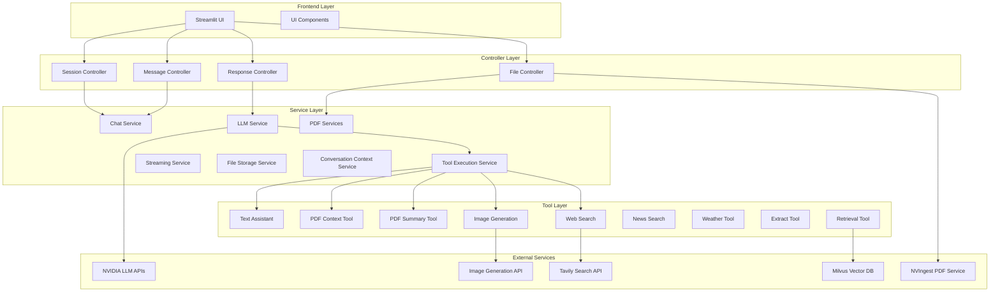
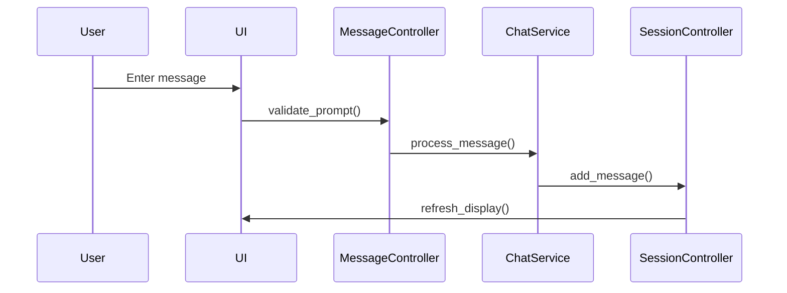
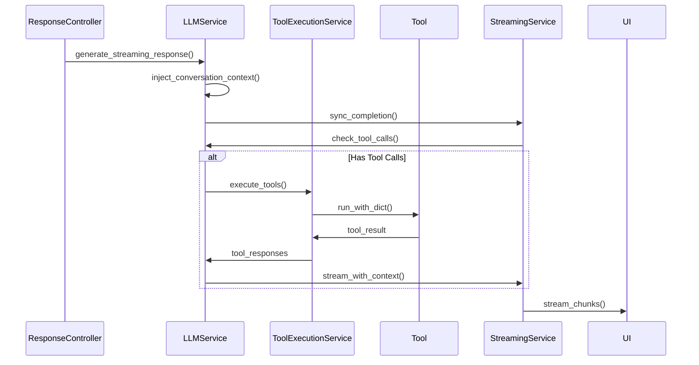

# Architecture Overview

Nano Chat Application follows a production-ready Model-View-Controller (MVC) architecture with clear separation of concerns and enterprise-grade design patterns.

## High-Level Architecture



## Core Design Principles

### 1. Separation of Concerns

Each layer has distinct responsibilities:

- **UI Layer**: User interface and presentation using Streamlit
- **Controller Layer**: Business logic and flow control
- **Service Layer**: Core functionality and external integrations
- **Tool Layer**: Specialized capabilities extending LLM functionality

### 2. Dependency Injection

Components receive dependencies through constructors:

```python
class ResponseController:
    def __init__(self, config, llm_service, message_controller,
                 session_controller, chat_history_component):
        self.config = config
        self.llm_service = llm_service
        self.message_controller = message_controller
        self.session_controller = session_controller
        self.chat_history_component = chat_history_component
```

### 3. Configuration-Driven

Centralized configuration management through `utils/config.py`:

```python
# All configuration from environment
config = AppConfig()

# Used throughout the application
self.max_pdf_size = config.file_processing.MAX_PDF_SIZE
self.brand_color = config.ui.BRAND_COLOR
```

### 4. Stateless Services

Services are stateless for scalability:

```python
class ChatService:
    # No internal state - all state in session
    def process_message(self, message, session_state):
        # Process and return, no side effects
```

## Component Responsibilities

### Controllers

Controllers orchestrate the application flow:

- **SessionController**: Manages user session state and file references
- **MessageController**: Handles message validation and chat history
- **FileController**: Manages PDF uploads and processing
- **ResponseController**: Orchestrates LLM responses and streaming

### Services

Services provide core functionality:

- **LLMService**: Simplified service orchestrating streaming, parsing, and tools
- **ChatService**: Processes chat interactions and message formatting
- **PDFContextService**: Automatically injects PDF content when relevant
- **PDFAnalysisService**: Intelligent PDF document analysis
- **StreamingService**: Handles response streaming with tool support
- **ToolExecutionService**: Manages parallel/sequential tool execution
- **FileStorageService**: External file storage (singleton pattern)
- **ConversationContextService**: Auto-injects conversation summaries

### Tools

Tools extend LLM capabilities:

- **TextAssistant**: Advanced text processing (summarize, proofread, translate)
- **PDFTextProcessor**: Process specific PDF pages
- **PDFSummary**: Generate/retrieve document summaries
- **ImageGeneration**: AI-powered image creation with style control
- **WebExtract**: Extract content from URLs
- **TavilySearch**: General web search
- **NewsSearch**: Current events and news
- **Weather**: Real-time weather data
- **Retrieval**: Semantic search in vector database
- **ConversationContext**: Analyze conversation history

## Data Flow

### 1. User Input Flow



### 2. LLM Response Flow with Tools



## Key Design Patterns

### 1. Singleton Pattern

Used for shared resources:

```python
class FileStorageService:
    _instance = None

    def __new__(cls):
        if cls._instance is None:
            cls._instance = super().__new__(cls)
        return cls._instance
```

### 2. Strategy Pattern

For PDF processing strategies:

```python
class PDFAnalysisService:
    def categorize_and_route(self, page_count):
        if page_count <= 5:
            return self._analyze_small_document()
        elif page_count <= 15:
            return self._analyze_medium_document()
        else:
            return self._analyze_large_document()
```

### 3. Registry Pattern

For tool management:

```python
class ToolRegistry:
    def register(self, tool: BaseTool):
        self._tools[tool.name] = tool

    def execute_tool(self, name: str, params: Dict):
        tool = self.get_tool(name)
        return tool.execute(params)
```

### 4. Context Preservation

For thread safety in Streamlit:

```python
def run_with_streamlit_context(func, *args, **kwargs):
    ctx = get_script_run_ctx()
    if ctx:
        add_script_run_ctx(threading.current_thread(), ctx)
    return func(*args, **kwargs)
```

## Scalability Considerations

### 1. Stateless Design

- Services don't maintain state
- All state in session storage
- Enables horizontal scaling

### 2. External Storage

- Files stored externally with reference IDs
- Prevents memory issues
- Allows distributed deployment

### 3. Async Processing

- Streaming responses
- Non-blocking operations
- Efficient resource usage
- Thread pool for tool execution

### 4. Context Management

- Sliding window for conversation history
- Automatic context injection
- Smart PDF context detection

## Security Architecture

### 1. Session Isolation

- Each user has isolated session
- No cross-session data access
- Automatic session cleanup

### 2. Input Validation

- All inputs validated
- Tool call instruction filtering
- Size limits enforced

### 3. API Key Management

- Keys stored in environment
- Never exposed to frontend
- Different keys per environment

## Error Handling

### 1. Layered Error Handling

```python
try:
    # Controller level
    result = self.process_action()
except ToolExecutionError as e:
    # Tool level error
    self.handle_tool_error(e)
except ServiceException as e:
    # Service level error
    self.handle_service_error(e)
except Exception as e:
    # System level error
    self.handle_system_error(e)
```

### 2. Graceful Degradation

- Fallback to simpler models
- Continue without failed tools
- User-friendly error messages

## Performance Optimization

### 1. Intelligent Processing

- Document size-based routing
- Parallel tool execution
- Batch processing for large PDFs

### 2. Caching

- File storage service (singleton)
- Streamlit's native caching
- Configuration caching

### 3. Lazy Loading

- Tools loaded on demand
- Models initialized when needed
- Resources released after use

### 4. Streaming

- Responses streamed in chunks
- Progress updated in real-time
- Memory efficient processing

## Next Steps

- Explore [Services Architecture](services.md) for service details
- Review [Controllers Architecture](controllers.md) for control flow
- See [Tools Architecture](tools.md) for tool system design
