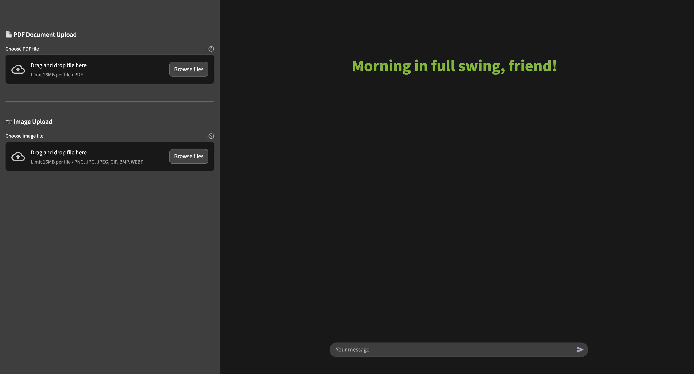

# Chat Interface Guide

Learn how to effectively use the Streamlit Chat Application's powerful conversational interface.

## Getting Started

### Accessing the Application

1. Open your web browser
2. Navigate to `http://localhost:8080` (or your deployment URL)
3. You'll see the chat interface with a welcome message

### Basic Chat

Simply type your message in the input box at the bottom and press Enter or click Send.



## Features Overview

### 1. Conversational AI

The chat interface provides natural conversation with an AI assistant powered by NVIDIA's language models.

**Example prompts:**
- "Explain quantum computing in simple terms"
- "Help me write a Python function to sort a list"
- "What are the benefits of renewable energy?"

### 2. Context Awareness

The assistant remembers your conversation history within the session:

```
You: What is machine learning?
AI: Machine learning is...

You: Can you give me an example?
AI: Sure! Building on what I explained about machine learning...
```

### 3. Multi-Model Support

Switch between different AI models based on your needs:

- **Fast Model**: Quick responses for simple queries
- **Standard Model**: Default balanced performance
- **Intelligent Model**: Advanced reasoning for complex tasks

To switch models, simply say:
- "Use the fast model"
- "Switch to intelligent mode"
- "Use standard model"

## Advanced Features

### Code Generation and Analysis

The assistant excels at programming tasks:

```
You: Write a React component for a todo list

AI: Here's a complete React component for a todo list:
[Detailed code with explanations]
```

### Markdown Support

The interface supports rich markdown formatting:

- **Bold text**
- *Italic text*
- `Code snippets`
- Lists and tables
- Mathematical expressions: $E = mc^2$

### Long Conversations

For lengthy discussions:
- The interface automatically manages scrolling
- Previous messages remain accessible
- Context is maintained throughout

## Interactive Elements

### PDF Document Analysis

Upload and analyze PDF documents directly:

1. Click the PDF upload button in the sidebar
2. Select your PDF file (max 200MB)
3. Ask questions about the document

**Example queries:**
- "Summarize this document"
- "What are the key findings?"
- "Extract all dates mentioned"

### Image Generation

Create images from text descriptions:

```
You: Generate an image of a futuristic city with flying cars
AI: [Creates and displays the image]
```

### Web Search Integration

Get real-time information:

```
You: What's the latest news about renewable energy?
AI: [Searches and provides current information]
```

## Tips for Better Results

### 1. Be Specific

Instead of:
> "Tell me about Python"

Try:
> "Explain Python decorators with examples"

### 2. Provide Context

Instead of:
> "Fix this code"

Try:
> "Fix this Python code that should calculate factorial but returns wrong results: [code]"

### 3. Use Follow-up Questions

Build on previous responses:
- "Can you explain that in more detail?"
- "How does that compare to [alternative]?"
- "Can you provide a practical example?"

### 4. Specify Output Format

Request specific formats:
- "Explain in bullet points"
- "Provide a step-by-step guide"
- "Create a comparison table"

## Keyboard Shortcuts

**Enter** - Send message
**Shift + Enter** - New line in message
**Ctrl/Cmd + K** - Clear chat (when available)
**Esc** - Cancel current input

## Interface Elements

### Message Display

Each message shows:
- **Avatar**: Distinguishes user and AI messages
- **Content**: The message text with formatting
- **Timestamp**: When the message was sent (hover to see)

### Status Indicators

- 🔄 **Typing indicator**: Shows when AI is processing
- ✅ **Completion marker**: Indicates response is complete
- ⚠️ **Error messages**: Clear explanations of any issues

### Sidebar Controls

The sidebar contains:
- PDF upload functionality
- Session information
- Settings and options
- Help resources

## Best Practices

### 1. Conversation Management

- **Start fresh**: Refresh the page for a new conversation
- **Save important info**: Copy responses you want to keep
- **Clear context**: Start a new session for unrelated topics

### 2. Complex Queries

For complex requests:
1. Break them into smaller parts
2. Build understanding step by step
3. Verify each step before proceeding

### 3. Error Recovery

If you encounter errors:
- Check your internet connection
- Verify the service is running
- Try a simpler query first
- Refresh the page if needed

## Common Use Cases

### Research and Learning

```
You: Explain the theory of relativity
You: How does time dilation work?
You: Can you provide real-world examples?
```

### Creative Writing

```
You: Help me write a short story about time travel
You: Suggest character names for a fantasy novel
You: Review this paragraph for clarity
```

### Technical Support

```
You: Debug this JavaScript error: [error message]
You: Explain this SQL query: [query]
You: How do I optimize this algorithm?
```

### Data Analysis

```
You: Analyze these sales figures: [data]
You: Create a summary of key trends
You: What insights can you draw?
```

## Troubleshooting

### Message Not Sending

- Check internet connection
- Verify you've entered text
- Try refreshing the page

### Slow Responses

- Switch to fast model for simple queries
- Check system resources
- Consider query complexity

### Incomplete Responses

- Ask for continuation: "Please continue"
- Request specific sections
- Break into smaller queries

## Privacy and Security

- Conversations are session-based
- No permanent storage of chat history
- Uploaded files are processed securely
- API keys are never exposed

## Getting Help

If you need assistance:
1. Check the troubleshooting section
2. Review the FAQ
3. Contact support
4. Report issues on GitHub

## Next Steps

- Explore [PDF Analysis](pdf-analysis.md) features
- Learn about [Image Generation](image-generation.md)
- Discover [Search Features](search-features.md)
- Read the [Architecture Overview](../architecture/overview.md)
